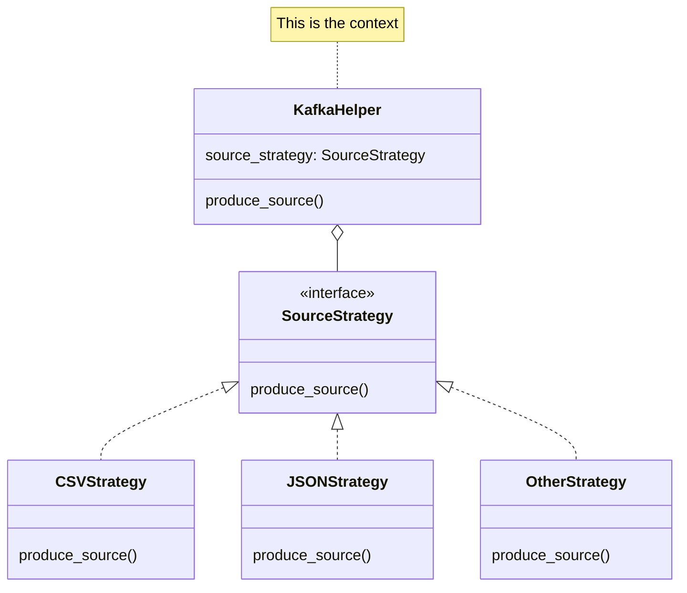

# POS Streaming Analytics

The data used in this project was taken from Databricks [repository](https://github.com/databricks/tech-talks/blob/master/datasets/point_of_sale_simulated.zip). This data is produced in Confluent Kafka to have a real-time data generator that can be ingested in Lakehouse and be processed in a Medallion Architecture.

## 1. Architecture


## 2. Data Lineage


## 3. Streaming
Encompasses the process of the data production to Confluent Kafka.
### 3.1. Design Pattern
Because this project is intended to be connected to a main application, it has to support various formats of input data. In this scenario, I ingested the CSV data, but in future scenarios, dealing with JSON, XML, or other data formats is possible. For that reason, the producer had to be prepared for all of these strategies.

The most suitable design pattern in this situation is the Strategy pattern, in which each strategy represents an input data format. This design pattern also allows for the enforcement of the Single Responsibility and Open/Closed principles.



### 3.2. Logging Support
With the same premise as above—meaning, the producer needs to be prepared for integration with an application—I added a logging configuration to document the steps of the ingestion process. The logging functionality is highly configurable and defined in `ingestion/config/logging.properties`

### 3.3. Avro Schemas
The code supports a Schema Registry configuration and retrieves the latest version of the schemas if they evolve over time. The topics created in Confluent Kafka have their respective Avro schemas, which are shown below:

* prod.stores
* prod.items
* prod.inventory.types
* prod.inventory.snapshots
* prod.inventory.transactions

Each topic has a key and value schema, and they can be configured in `ingestion/schemas/`
## 4. Lakehouse
The Lakehouse follows the Medallion Architecture: bronze, silver and gold.
### 4.1. Structured Streaming
Since Kafka is the data source at this step in the pipeline, Structured Streaming was needed in the bronze layer. Even if the source was not Kafka and instead an object storage, an Autoloader based on Structured Streaming could be a suitable way to ingest data. For that reason, manipulating Structured Streaming correctly turned out to be an important step for data ingestion in the Lakehouse, unless you decide to use a more expensive strategy such as Delta Live Tables.

The code below shows how Structured Streaming was configured, and how the schemas were handled. It is important to emphasize the first 5 bytes of Avro metadata that are stored in topics. This is the reason a `substring` was necessary when consuming the messages.

Note: This is a simplified scenario in which schemas don't change, and if they do, a `foreachbatch` function must be created for managing the latest schema version.

```python
(
        spark.readStream.format("kafka")
        .option("kafka.bootstrap.servers", cc_conf["bootstrap.servers"])
        .option("kafka.security.protocol", cc_conf["security.protocol"])
        .option(
            "kafka.sasl.jaas.config",
            (
                f"{login_module_class} "
                "required "
                f"username='{cc_conf['sasl.username']}' "
                f"password='{cc_conf['sasl.password']}';"
            ),
        )
        .option("kafka.ssl.endpoint.identification.algorithm", "https")
        .option("kafka.sasl.mechanism", cc_conf["sasl.mechanisms"])
        .option("subscribe", topic)
        .option("startingOffsets", "earliest")
        .option("failOnDataLoss", "false")
        .load()
        .selectExpr("substring(value, 6) as avro_value")
        .select(
            from_avro(col("avro_value"), topic_schema[1]).alias("avro_value"),
        )
        .writeStream.format("delta")
        .outputMode("append")
        .trigger(
            processingTime=trigger["processingTime"],
            availableNow=trigger["availableNow"],
        )
        .option(
            "checkpointLocation",
            f"/user/hive/warehouse/{schema}/{table}/_checkpoints",
        )
        .queryName(f"{catalog}_{schema}_{table}")
        .toTable(f"{catalog}.{schema}.{table}")
    )
```

### 4.2. Unity Catalog
All created tables were managed tables, and they were stored in an account's metastore. That is, the used metastore was managed by Unity Catalog, and inside it, I created a catalog and schema for this project. Using the Hive metastore is becoming legacy, and I recommend using Unity Catalog for future projects.

## 5. Dashboard

